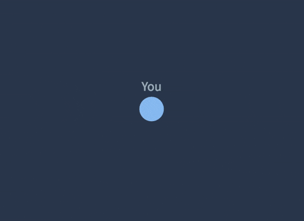

# p2p-graph [![travis][travis-image]][travis-url] [![npm][npm-image]][npm-url] [![downloads][downloads-image]][downloads-url] [![javascript style guide][standard-image]][standard-url]

[travis-image]: https://img.shields.io/travis/feross/p2p-graph/master.svg
[travis-url]: https://travis-ci.org/feross/p2p-graph
[npm-image]: https://img.shields.io/npm/v/p2p-graph.svg
[npm-url]: https://npmjs.org/package/p2p-graph
[downloads-image]: https://img.shields.io/npm/dm/p2p-graph.svg
[downloads-url]: https://npmjs.org/package/p2p-graph
[standard-image]: https://img.shields.io/badge/code_style-standard-brightgreen.svg
[standard-url]: https://standardjs.com

### Real-time P2P network visualization with D3



Works in the browser with [browserify](http://browserify.org/)! This module is used
by [WebTorrent](http://webtorrent.io). You can see this package in action on the
[webtorrent.io](https://webtorrent.io/) homepage or play with it on the [esnextb.in demo](https://esnextb.in/?gist=6d2ede2438db14c108d30343f352ad8c).

## Install

```
npm install p2p-graph
```

## Usage

```js
var Graph = require('p2p-graph')

var graph = new Graph('.root')

graph.on('select', function (id) {
  console.log(id + ' selected!')
})

// Add two peers
graph.add({
  id: 'peer1',
  me: true,
  name: 'You'
})
graph.add({
  id: 'peer2',
  name: 'Another Peer'
})

// Connect them
graph.connect('peer1', 'peer2')
```

# API

**Heads Up!** : Represented Graphs are directed!

> In graph theory, a directed graph (or digraph) is a graph that is a set of vertices connected by edges, where the edges have a direction associated with them.

### graph = new Graph(rootElem)

Create a new P2P graph at the root DOM element `rootElem`. In addition to an
`Element`, a query selector string (like `'.my-cool-element'`) can also be passed
in.

### graph.add(peer)

Add a peer to the graph. The `peer` object should contain:

```
{
  id: 'unique-identifier', // should be unique across all peers
  me: true, // is this the current user?
  name: 'display name' // name to show in the graph UI
}
```

### graph.connect(id1, id2)

Connect to two nodes, identified by `id1` and `id2`, to each other.

### graph.disconnect(id1, id2)

Disconnect two nodes, identified by `id1` and `id2`, from each other.

### graph.areConnected(id1, id2)

Check whether two nodes identified by `id1` and `id2` are somehow connected (`id1 --> id2` or `id2 --> id1`).

### graph.getLink(id1, id2)

If exists return the link between `id1` and `id2`, otherwise `null`.

### graph.hasPeer(Id1[, ...IdX])

Return `true` if all the given Nodes exists, otherwise `false`.

### graph.hasLink(Id1, Id2)

Return `true` the given Link exists, otherwise `false` (direction matters!).

### graph.remove(id)

Remove a node, identified by `id`, from the graph.

### graph.seed(id, isSeeding)

Change a node's status identified by `id`, `isSeeding` must be true or false.

### graph.rate(id1, id2, speed)

Update the transfer rate between two nodes identified by `id1` and `id2`. `speed` must be expressed in bytes.

### graph.list()

Return an array of Nodes.

### graph.destroy()

Destroys the graph and all the listeners related to it.

### graph.on('select', function (id) {})

Event is fired when a node is selected (clicked on) by the user. The `id` argument is either the id
of the selected peer, `false` to indicate that the peer has been deselected. Only one peer can be
selected at any given time.

## license

MIT. Copyright (c) [Feross Aboukhadijeh](http://feross.org).
